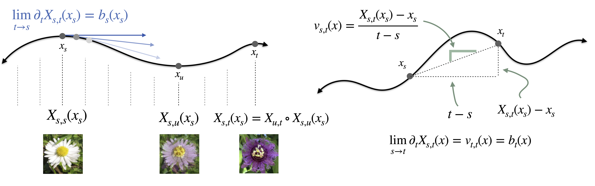

# How to build a consistency model

[](https://neurips.cc/)
[](https://arxiv.org/abs/2505.18825)
[](https://www.python.org/downloads/)
[](https://github.com/google/jax)



**Official repository for "How to build a consistency model: Learning flow maps via self-distillation" (NeurIPS 2025).** https://arxiv.org/abs/2505.18825

by Nicholas M. Boffi (CMU), Michael Albergo (Harvard), and Eric Vanden-Eijnden (Courant Institute of Mathematical Sciences, Capital Fund Management)

## Background

Flow maps are a new class of generative models that generalize consistency models, enabling the generation of samples in just one or a few forward passes of the learned network. 

This work introduces a unified mathematical framework for their design, revealing that existing approaches (consistency models, consistency trajectory models, shortcut models) are all particular cases of a broader design space. 

With this insight in hand, we present three direct training algorithms based on a notion of *self-distillation*, in which the flow map distills an implicit flow to eliminate dependence on a pre-trained teacher. We prove their connections to existing methods and show that a new **Lagrangian Self-Distillation (LSD)** approach delivers superior performance and training stability.


## What this paper does

### 1. Unifies the theory of consistency models

We show that the **tangent condition** -- a simple differential relation between the flow map and its underlying velocity field -- yields three equivalent characterizations of the flow map. This framework exposes the full design space of training objectives and clarifies their properties both theoretically and in practice. Existing methods emerge as particular points in this space.

### 2. Introduces three training algorithms

From our characterizations, we derive three self-distillation methods:

- **Lagrangian Self-Distillation (LSD)** -- An approach that matches the time derivatives of the flow map to the underlying flow. The method avoids spatial Jacobians and bootstrapping from small steps during training, leading to high performance and training stability.
- **Progressive Self-Distillation (PSD)** -- An approach that uses the map itself to bootstrap smaller steps into larger steps. Avoids the use of spatial or temporal derivatives, leading to excellent training stability, but may exhibit distribution shift and compounding errors. Reduces to shortcut models in a particular case.
- **Eulerian Self-Distillation (ESD)** -- An approach that learns the flow map by minimizing a partial differential equation residual. Involves both spatial and temporal derivatives, leading to training instability. Reduces to consistency training for consistency models and consistency trajectory models as particular cases.

### 3. Empirical analysis

Systematic evaluation across CIFAR-10, CelebA-64, AFHQ-64, and 2D Checker shows:
- **LSD achieves best FID scores consistently**
- **Training stability matches flow matching** -- no multi-phase training pipelines or teacher distillation needed
- **No spatial Jacobians** -- computational advantage over ESD and consistency models
- **Few-step quality competitive with multi-step flows**


## Installation

### Requirements
- Python 3.9+
- CUDA 11.8+ or 12.0+ (GPU required for image experiments)
- 32GB+ GPU memory (recommended for 64×64 images)
- Linux or macOS

### Setup

**1. Clone and create environment**
```bash
git clone https://github.com/nmboffi/flow-maps.git
cd flow-maps
conda create -n flowmaps python=3.9
conda activate flowmaps
```

**2. Install JAX** (choose your CUDA version)
```bash
# CUDA 12.x
pip install --upgrade "jax[cuda12_pip]" -f https://storage.googleapis.com/jax-releases/jax_cuda_releases.html

# CUDA 11.8
pip install --upgrade "jax[cuda11_pip]" -f https://storage.googleapis.com/jax-releases/jax_cuda_releases.html

# CPU only
pip install --upgrade jax
```

**3. Install dependencies**
```bash
pip install \
    flax==0.8.2 \
    optax==0.2.2 \
    ml_collections==0.1.1 \
    tensorflow==2.15.0 \
    tensorflow-datasets==4.9.4 \
    wandb==0.16.5 \
    matplotlib==3.7.0 \
    seaborn==0.12.2 \
    scipy==1.10.1 \
    click==8.1.7 \
    requests==2.31.0 \
    tqdm==4.65.0
```

**4. Verify**
```bash
python -c "import jax; print(f'JAX {jax.__version__} | Devices: {jax.devices()}')"
```


## Quick start

### Training

```bash
python py/launchers/learn.py \
    --cfg_path configs.cifar10 \
    --slurm_id 0 \
    --dataset_location /path/to/datasets \
    --output_folder /path/to/outputs

# Other datasets
python py/launchers/learn.py --cfg_path configs.celeba64 --slurm_id 0
python py/launchers/learn.py --cfg_path configs.afhq64 --slurm_id 0
python py/launchers/learn.py --cfg_path configs.checker --slurm_id 0
```

**Algorithm selection** via `slurm_id`, also enabling sweeps with slurm job arrays:

| ID | Algorithm |
|----|-----------|
| 0 | LSD |
| 1 | PSD-uniform |
| 2 | PSD-midpoint |
| 3 | ESD |

### Evaluation

```bash
# Compute FID
python py/launchers/calc_dataset_fid_stats.py --dataset cifar10 --out cifar10_stats.npz
python py/launchers/sample_and_calc_fid.py \
    --cfg_path configs.cifar10 \
    --checkpoint checkpoints/model.pkl \
    --stats cifar10_stats.npz \
    --n_steps 1
```


## Datasets

- **CIFAR-10**: Auto-downloaded via TensorFlow Datasets
- **CelebA-64**: Auto-downloaded via TensorFlow Datasets; pre-processed via cropping in included code.
- **AFHQ-64**: Download via HuggingFace datases and crop to 64x64.
- **Checker**: Generated on-the-fly (2D toy problem)


## Multi-GPU training

This codebase is written for single-node, multi-GPU training. JAX automatically uses all visible GPUs:

```bash
# Use all GPUs
python py/launchers/learn.py --cfg_path configs.cifar10 --slurm_id 0

# Restrict to specific GPUs
CUDA_VISIBLE_DEVICES=0,1,2,3 python py/launchers/learn.py --cfg_path configs.cifar10 --slurm_id 0
```


## Reproducibility

Each experiment reported in the paper can be exactly reproduced by using one of the included configuration files.


## Project structure

```
flow-maps/
├── py/
│   ├── configs/          # Experiment configs (cifar10.py, celeba64.py, etc.)
│   ├── common/
│   │   ├── losses.py     # LSD, PSD, ESD implementations
│   │   ├── flow_map.py   # Flow map wrappers
│   │   └── edm2_net.py   # EDM2 UNet architecture
│   └── launchers/        # Training (learn.py) and eval scripts
├── notebooks/            # ipython notebooks for figure generation
```


## Citation

If you found this repository useful or the associated paper interesting, please consider citing:

```bibtex
@misc{boffi2025buildconsistencymodellearning,
      title={How to build a consistency model: Learning flow maps via self-distillation},
      author={Nicholas M. Boffi and Michael S. Albergo and Eric Vanden-Eijnden},
      year={2025},
      eprint={2505.18825},
      archivePrefix={arXiv},
      primaryClass={cs.LG},
      url={https://arxiv.org/abs/2505.18825},
}
```


## License

This code is distributed under the MIT License.
